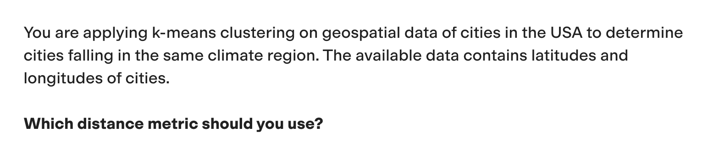
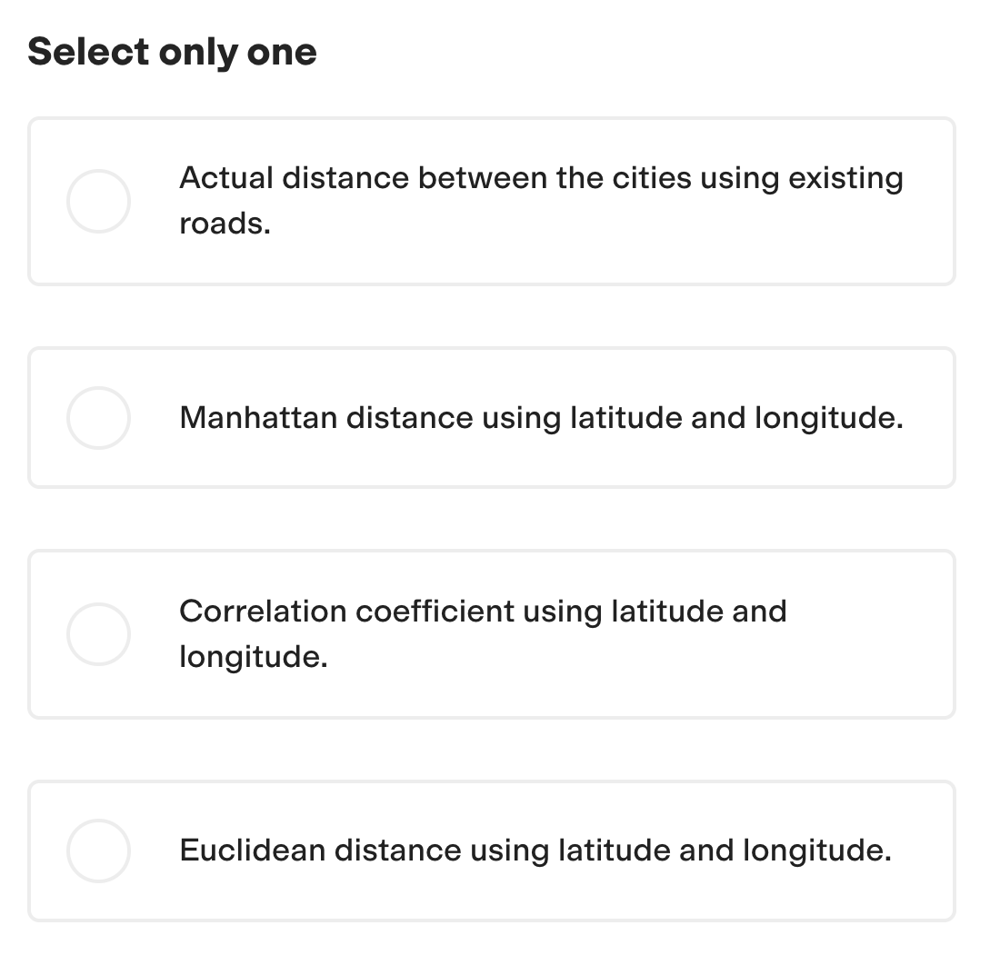

# Pass any TestGorilla Assessment 🦍

### Introduction

These last days, I've been invited to many TestGorilla Assessments for the Python Developer positions I've been applying for.

It was a bit annoying when, after being invited to complete an assessment at TestGorilla for a Python AI Developer role I applied for—where the job description emphasized:

> Python, FastAPI, LLMs, OpenAI, Embeddings, RAG, Function-calling, structured output, Fine-tuning (you know, the usual Python AI role)

I realized the test was focused on Machine Learning rather than Applied AI… But I decided to go along with it anyway.

One of the first questions was the following:

The question wasn't related to the technologies or tools I work with, nor did it have anything to do with the job description. It was a poor choice of questions because they assumed Machine Learning and Applied AI with LLMs are the same, but they are actually very different fields.

I didn't know the answer to this question, and I encountered several other questions centered around classic ML concepts that weren't relevant to my expertise. After completing the test, I realized that outdated evaluations like this might be the reason for rejections—especially when applying for an **AI DEVELOPER ROLE** in the AI era.

So, I decided to get creative and explore a concept:

### The Experiment 🛠️

I conceptualized and then built a small script as an experiment. This script listens for a key press on the keyboard. When pressed, it takes a screenshot of the screen. The screenshot is then sent to GPT-4 Vision for analysis, specifically structured to answer multiple-choice questions.

Once GPT-4 Vision processes the screenshot, it sends back a structured response with the answer as a single number (e.g., 1, 2, 3, etc.). The script then uses the operating system's notification system to alert the user of the answer discreetly, ensuring they wouldn't need to swap windows or alt-tab, which TestGorilla monitors.

For those interested in examining this conceptual tool, I've made the code available on GitHub: [https://github.com/Fakamoto/gorilla_test](https://github.com/Fakamoto/gorilla_test)

### Potential Results 🎯

In theory, such a tool could potentially achieve perfect scores on these tests. It's important to emphasize that I did not actually use this tool to pass any tests; it was developed purely as an experiment and proof of concept.

### Why This Matters

I explored and built this concept as a wake-up call to show that these kinds of tests are outdated and don't adapt to the LLM AI Age. Companies hiring for Python AI developers should be the first ones to notice this and change their evaluation processes. It's ironic that this isn't happening. The fact that such a tool could be conceptualized, built, and potentially used should serve as a stark reminder for companies, especially those hiring for AI-related roles.

This experiment highlights the urgent need for more relevant, practical, and AI-aware assessment methods that truly evaluate a candidate's skills in the rapidly evolving field of AI development. It's a call to action for companies to rethink their hiring processes and ensure they're keeping pace with the technologies they're hiring for.
